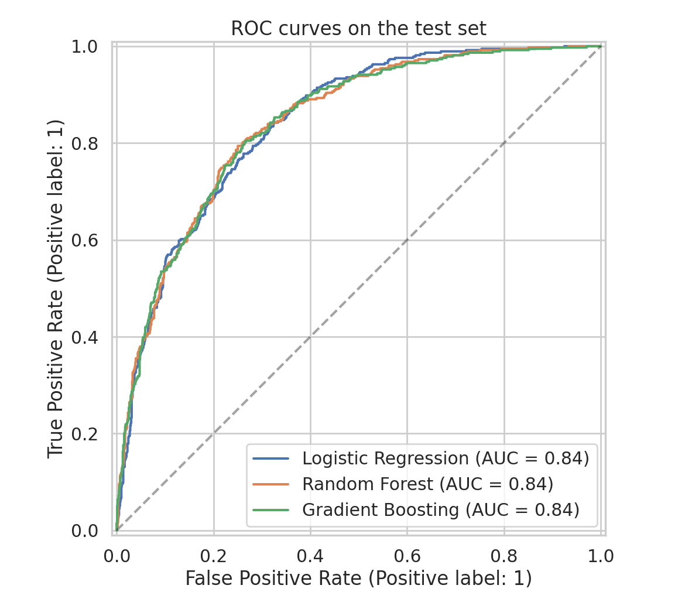
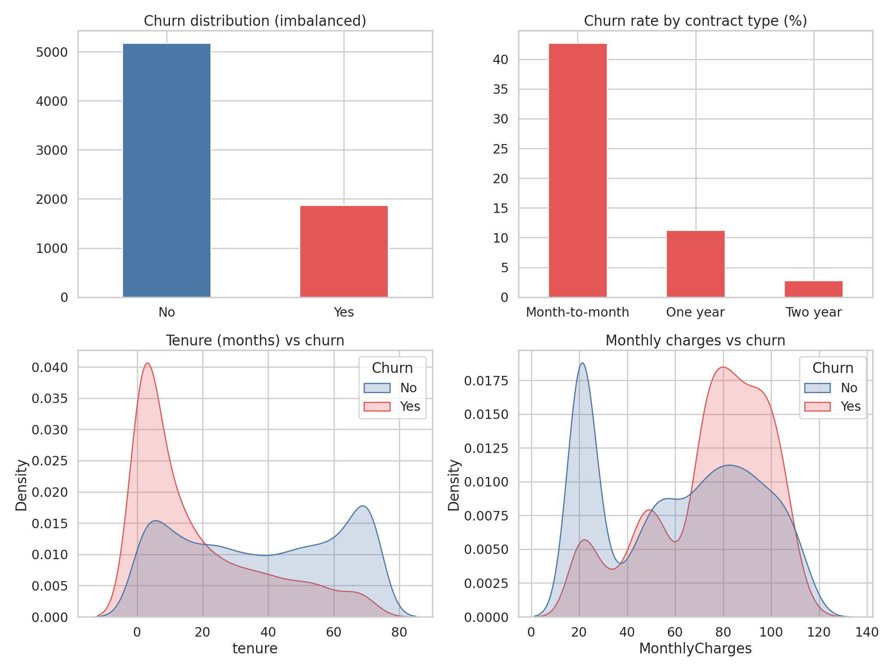
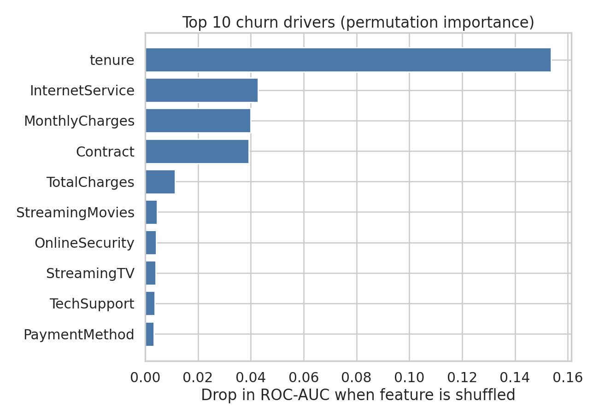

# 📉 Customer Churn Prediction


An end-to-end machine learning project that predicts which telecom customers are likely to cancel their service, explains **why**, and serves the predictions in an interactive Streamlit app.

> **Business question:** Acquiring a new customer costs far more than keeping an existing one. If we can flag at-risk customers early, the retention team can act before they leave.

## 🖥️ Demo

> Add a screenshot or GIF of the Streamlit app here:
file:///C:/Users/lasar/OneDrive/Pictures/Screenshots/Screenshot%202026-10-05%20123026.png

Live app: https://customer-churn-prediction-bfek4scdo8vahahz6gpedf.streamlit.app/

## 🎯 Results

Evaluated on a held-out test set (20% of 7,043 customers, stratified):

| Metric | Score |
|---|---|
| ROC-AUC | **0.84** |
| Recall (churners caught) | **0.78** |
| Precision | 0.50 |
| Accuracy | 0.74 |

Three models were compared with 5-fold stratified cross-validation:

| Model | CV ROC-AUC | Test ROC-AUC |
|---|---|---|
| Logistic Regression ✅ | 0.846 | 0.842 |
| Random Forest | 0.846 | 0.842 |
| Gradient Boosting | 0.846 | 0.841 |



**Takeaway:** all three models perform almost identically, so the simplest and most interpretable one (Logistic Regression) was chosen. More complex did not mean better here, and the app can explain every individual prediction because of that choice.

## 🔍 Key insights




- **Contract type is the strongest signal.** Month-to-month customers churn at **42.7%**, versus 11.3% for one-year and 2.8% for two-year contracts.
- **New customers are the most fragile.** Churn is heavily concentrated in the first few months of tenure.
- **Higher monthly bills correlate with churn**, especially for fiber-optic internet customers.
- Top drivers by permutation importance: `tenure`, `InternetService`, `MonthlyCharges`, `Contract`, `TotalCharges`.



## 🧠 Approach

1. **Cleaning:** fixed blank `TotalCharges` values for brand-new customers, converted types.
2. **EDA:** class imbalance (26.5% churn), churn by contract, tenure and price distributions.
3. **Preprocessing:** scikit-learn `ColumnTransformer` (scaling for numeric, one-hot for categorical) inside a `Pipeline`, so there is **no data leakage** between train and test.
4. **Imbalance handling:** `class_weight="balanced"`, with evaluation focused on ROC-AUC and recall, not just accuracy.
5. **Model selection:** stratified 5-fold CV, then a single final evaluation on the untouched test set.
6. **Explainability:** permutation importance globally, per-customer feature contributions in the app.

### ⚖️ Trade-off worth knowing
The model is tuned to **catch churners** (recall 0.78), so about half of the customers it flags will not actually leave (precision 0.50). For a retention campaign where a discount is cheap compared to losing a customer, that is a reasonable trade. The decision threshold (0.5) can be raised if the cost of false alarms is higher.

## 🚀 Run it yourself

```bash
pip install -r requirements.txt
python train.py            # trains models, saves charts and models/churn_model.joblib
streamlit run app.py       # launches the interactive app
```

## 📁 Project structure

```
churn-prediction/
├── data/telco_churn.csv        # IBM Telco Customer Churn sample dataset
├── images/                     # EDA, ROC, confusion matrix, feature importance
├── models/                     # trained pipeline + metrics.json
├── train.py                    # full training and evaluation pipeline
├── app.py                      # Streamlit app
└── requirements.txt
```

## 🔭 Ideas to extend

- Tune the decision threshold using a cost-sensitive analysis (cost of an offer vs. lifetime value lost)
- Add SHAP explanations
- Try XGBoost / LightGBM and compare
- Deploy on Streamlit Community Cloud and link it in your post

## 📚 Data

IBM Telco Customer Churn sample dataset (7,043 customers, 20 features), publicly available.

## 🛠 Tech stack

Python · pandas · scikit-learn · matplotlib · seaborn · Streamlit
